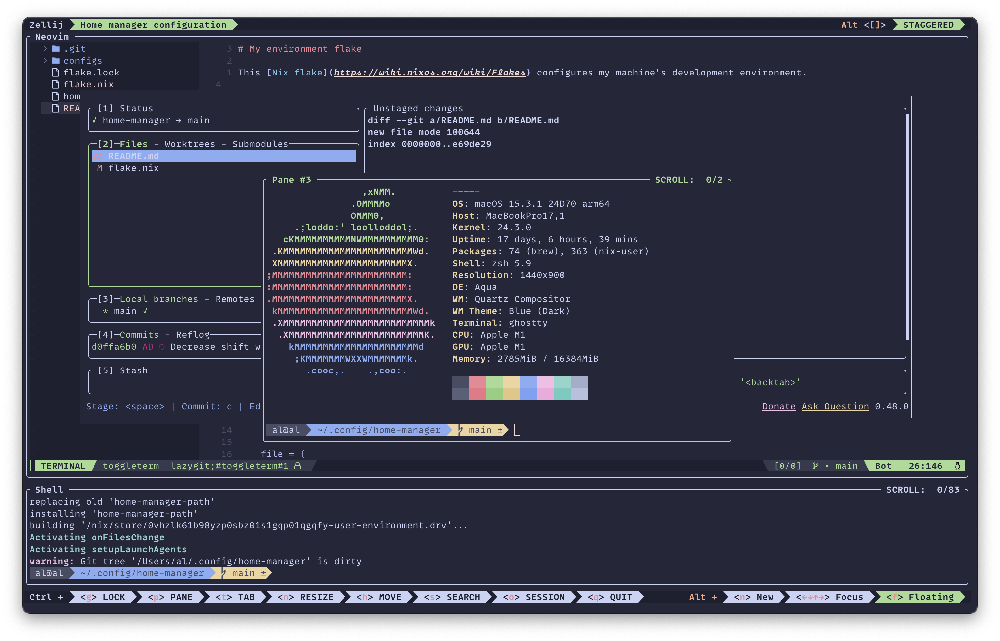

# My environment flake

This [Nix flake](https://wiki.nixos.org/wiki/Flakes) configuration is my
declarative, portable, bespoke dev environment.

- Terminal emulator: [Ghostty](https://ghostty.org/)
- Terminal multiplexer and session manager: [Zellij](https://zellij.dev/)
- Text editor: [Neovim](https://neovim.io/) configured with
  [nvf](https://github.com/NotAShelf/nvf)
- Themes: [Catppuccin](https://catppuccin.com/)
- User environment configuration:
  [Home manager](https://github.com/nix-community/home-manager)
- Shell: [Zsh](https://www.zsh.org/)
- Font: [MonoLisa](https://www.monolisa.dev/)
